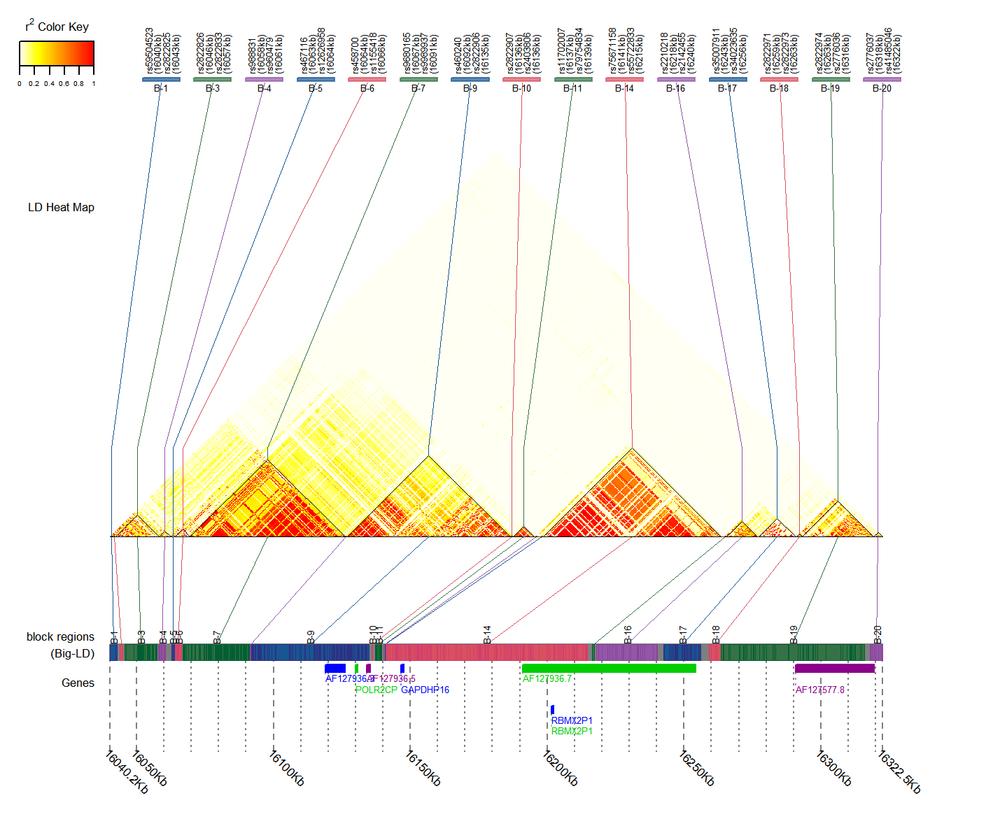
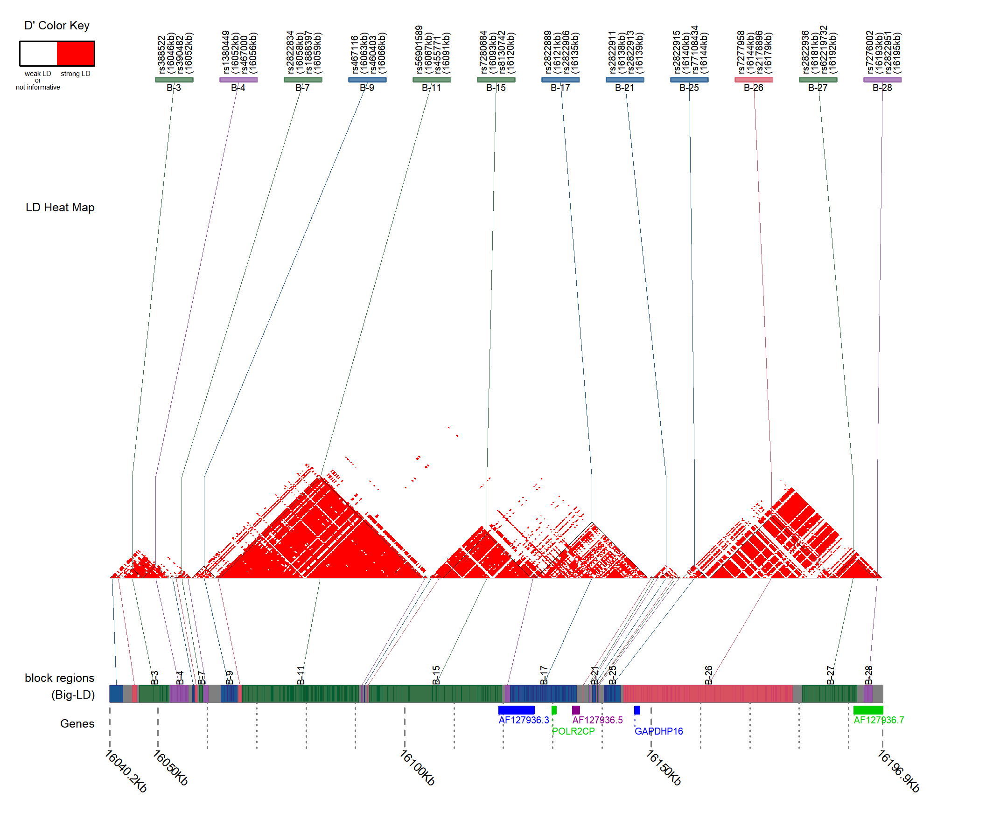
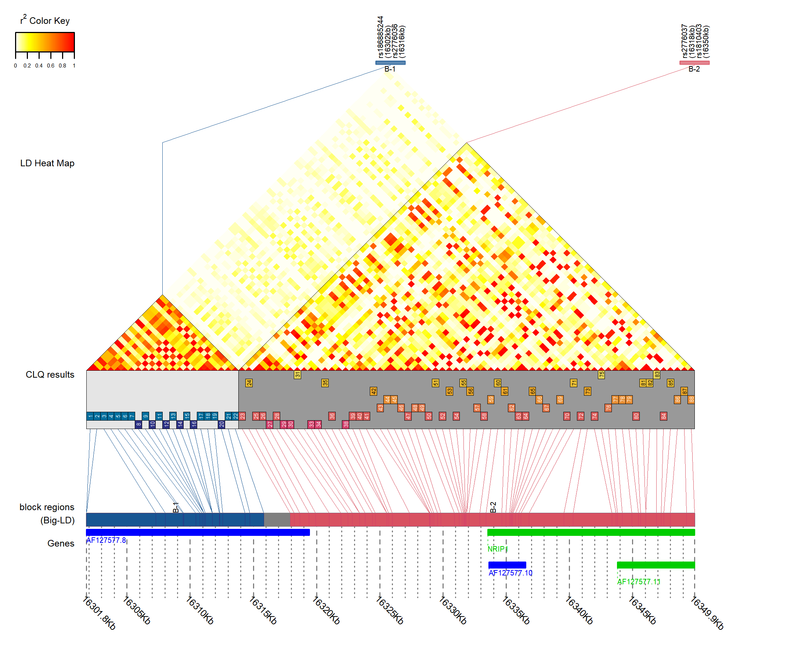

  ```{r style, echo = FALSE, results = 'asis'}
  BiocStyle::markdown()
  ```

# Introduction


In this package **gpart**, we provide a new SNP sequence partitioning method which partitions the whole SNP sequence based on not only LD block structures but also gene location information. The LD block construction for GPART is performed using Big-LD algorithm, with additional improvement from previous version reported in Kim et al.(2017). We also add a visualization tool to show the LD heatmap with the information of LD block boundaries and gene locations in the package.

**gpart** including 4 functions as follows.

* CLQD
* BigLD
* GPART
* LDblockHeatmap

<!-- The **BigLD** was developed based on the existing **BigLD** packages. The **BigLD2** adopts a new heuristic algorithm for CLQ algorithm, and supports various input file types and LD measure (D' added). The `GPART` function, newly developed in this package, partitions the whole SNP sequences into blocks which satisfying the pre-defined size thresholds. Also visualization function `LDblockHeatmap2` shows not only heatmap and block boundaries but also gene information, bp position, and CLQ results. -->

<!-- When comparing `BigLD2` and `BigLD`, the average size of LD blocks constructed by `BigLD2` is larger than that generated by `BigLD`. Thus the average $r^2$ values within a block generated by `BigLD2` tend to be slightly lower than that generated by `BigLD`. However, the average $r^2$ values across the two consecutive blocks constructed by `BigLD2` are also lower than that constructed by `BigLD`.  -->


# Running gpart

## Installation

Download and install the most current of "gpart".

```{r install_igraph, eval = FALSE}
library(gpart)
```
```{r library, include=FALSE}
library(gpart)
```

## Input data for gpart

To run the `CLQD` and `BigLD` function, you need two kind of input data, additive genotype data in matrix or data.frame (`geno`) and SNP information data(`SNPinfo`).
Each column of `geno` includes the additive genotypes of individuls for each SNP, and each rwo of `SNPinfo` includes the chromosome name, rsID and bp of each SNP.


```{r data_read, echo=TRUE}
data(geno)
data(SNPinfo)
```

```{r datatype_geno, echo=TRUE}
geno[1:5, 1:5]
```
```{r datatype_SNPinfo, echo=TRUE}
head(SNPinfo)
```

## Functions

### CLQD function.

CLQD is an algorithm for clustering the SNPs into LD bins which are high-correlated SNP groups.

#### Examples
```{r CLQDeg1, eval=FALSE}
clq1 = CLQD(geno[, 1:300], SNPinfo[1:300,])
clq2 = CLQD(geno[, 1:300], SNPinfo[1:300,], LD = "Dprime")
clq3 = CLQD(geno[, 1:300], SNPinfo[1:300,], CLQcut = 0.7, hrstType = "fast", 
            CLQmode = "maximal")

```

```{r CLQDeg1_inF, include=FALSE}
clq1 = CLQD(geno[, 1:300], SNPinfo[1:300,])
```

#### Values

CLQD returns a vector of bin numbers of SNPs. `NA` means that the corresponding SNP is a singleton, i.e. that SNP is an LD bin of size 1.

```{r CLQDeg1_2}
# CLQ results for 300 SNPs
head(clq1, n = 20)
table(clq1)
# n of singletons
sum(is.na(clq1))
```


#### Details

```{r CLQDeg2, eval=FALSE}
CLQD(geno[, 1:500], SNPinfo[1:500,], LD = "Dprime")
```

The algorithm first constructs a graph in which the vertices are SNPs and each edge is an unordered pair of two SNPs. Each edge weight is given by LD value between two SNPs. CLQD uses $r^2$ or D' as the LD measurement. If you want to measure $r^2$, set `LD = "r2"`(default), otherwise set `LD = "Dprime"`. When `LD = "r2"`, we have to specify a threshold for $|r|$ by using the parameter `CLQcut`. The default is `CLQcut = 0.5`. For the D', we define valid edges following definition of 'strong LD' suggested by Gabriel et al., (2002).

```{r CLQDeg3, eval=FALSE}
CLQD(geno[, 1:500], SNPinfo[1:500,], CLQcut = 0.7, hrstType = "fast", 
     CLQmode = "maximal")

```

CLQ algorithm first detects maximal cliques in the constructed graph and then takes cliques which include SNPs not yet selected as LD bins greedily. There are two clique selection methods. If you want to give a priority to a clique of larger size, set as `CLQmode = "maximal"`, or if you want to give a priority to a cluster of denser LD bins (that is, the average distance of SNPs in a bin is smaller), set as `CLQmode = "density"`(default).

For the worst case, memory and time to listing all maximal cliques could be exponentially increased. Although, we can find all maximal cliques in reasonable time and memory usage for the most graphs corresponding to the LD structures. However, there are SNP sequence regions in which the time and memory usage for detecting maximal cliques extremely increasing, and we suggested heuristic algorithm for these regions.
There are two kind of heuristic algorithm, "fast" and "near-nonhrst"(default). You can choose which algorithm to be used by setting the option `hrstType` such as `hrstType = "fast"` or `hrstType = "near-nonhrst"`. "fast" algorithm needs less memory usage and time than the "near-nonhrst" algorithm. The "near-nonhrst" algorithm needs more memory and time than "fast" algorithm, but it returns the results similar to results obtained by non-heuristic algorithm. Adopting the "near-nonhrst" algorithm should specify a heuristic parameter `hrstParam` that specifies how similar to the non-heuristic result. Entering a high value produces results similar to non-heuristic results. It is recommended to set at least 150, and the default value is 200. To use the non-heuristic algorithm, set as `hrstType = "nonhrst"`.

If the distance of two consecutive SNPs in a clique is too far, we can divide the clique into two cliques. The parameter for the threshold is `clstgap` and the default is 40000(bp).


### BigLD function.

Big-LD is an algorithm to construct LD blocks using the interval graph modeling. The detailed algorithm can be found in Kim et al.(2017).
Big-LD have several distinctive features. Since the Big-LD algorithm designed based on the graph modeling, large and mosaic pattern of LD blocks which allow the “holes” can be detected by the algorithm. Moreover, the boundaries of LD blocks identified by Big-LD tend to agree better with the recombination hotspots than the above mentioned methods. It also was shown that the LD block boundaries found by this algorithm are more invariant for the changes in the marker density compared to existing methods. For the vast number of SNPs, execution of the algorithm was completed within a reasonable time.

#### Examples

```{r BigLDeg1, results='hide'}
# When you have to input R object, use the parameter `geno` and `SNPinfo`
res1 = BigLD(geno = geno, SNPinfo = SNPinfo) # use r2 measure (default)
res1_dp = BigLD(geno = geno, SNPinfo = SNPinfo, LD = "Dprime") #use D' measure
```
```{r BigLDshow}
head(res1)
head(res1_dp)
```

#### Values
BigLD returns a data frames of Big-LD results, and it contains 7 information of each block (chromosome name, indices of the first SNP and last SNP, rsID of the first SNP and last SNP, bp of the first SNP and last SNP)

#### Details

```{r BigLDeg2, eval=FALSE}
# When you have to input files directly, use the parameter `genofile` (and `SNPinfofile`) instead of `geno` and `SNPinfo`.
res2 = BigLD(genofile = "geno.vcf")
res3 = BigLD(genofile = "geno.ped", SNPinfofile = "geno.map")
# change LD measure, hrstParam
res4 = BigLD(geno = geno, SNPinfo = SNPinfo, LD = "Dprime", hrstParam = 150)
```

The input consists of genotype and SNP information. The function also can directly load the data from the files of PLINK format or VCF (.ped, .map, .traw, .raw, .vcf). As with `CLQD` function, you can choose an LD measure to use (`LD`), r2 threshold (`CLQcut`), heuristic algorithm (`hrstType`, `hrstParam`), CLQ methods (`CLQmode`), threshold for distance of consecutive SNPs in a clique (`clstgap`).

```{r BigLDeg3, eval=FALSE}
res5 = BigLD(geno = geno, SNPinfo = SNPinfo, MAFcut = 0.1, appendRare = TRUE)
```

`BigLD` algorithm construct LD blocks using the common variants after filtering rare variants by the option `MAFcut`(default 0.05). To include a rare variant in the LD block results, add the `appendRare = TRUE` option. Rare variants with maf $\leq$ `MAFcut` could be appended to a proper LD block already constructed by common variants.

We can force specified SNP to be the last SNP in a block using `cutByForce` option.

```{r BigLDeg4, results='hide'}
cutlist = rbind(c(21, "rs440600", 16051956), c(21, "rs9979041", 16055738))
res6 = BigLD(geno = geno, SNPinfo = SNPinfo, cutByForce = cutlist)
```
```{r BigLDeg4show}
print(cutlist)
head(res6)
```


### GPART function


GPART is a SNP sequence partitioning algorithm based on the Big-LD results. Big-LD algorithm might allow quite long LD blocks or very small LD blocks, also do not consider the gene region information during the LD block construction procedures. GPART could partition SNP sequences considering gene region information by merging the overlapping gene regions and LD blocks. To partition the SNP sequences into blocks satisfying the predefined size threshold, GPART split the big blocks or merging the small consecutive blocks.

For the function `GPART`, you must input gene information data.

```{r data_read_gene, echo=TRUE}
data(geneinfo)
head(geneinfo)
```

The GPART functions uses BigLD results as an initial clustering results. Therefore you need to input the BigLD results using the option `BigLDresult`. In other ways, you can make that the GPART function automatically run the `BigLD` before the main GPART algorithm (set `BigLDresult=NULL`, default). For this case, you can set parameters (`CLQmode`, `CLQcut`) for `BigLD` additionally.

#### Examples

```{r GPARTeg0}
# gene based GPART using the pre-calculated BigLD result 'res1'
# default minsize = 4, maxsize = 50
Gres0 = GPART(geno = geno, SNPinfo = SNPinfo, geneinfo = geneinfo, BigLDresult = res1,
              minsize = 4, maxsize = 50)
```

#### Values
`GPART()` returns data frame which contains 9 information of each partition (chromosome, indices of the first SNP and last SNP in the inputted data, rsIDs of the first SNP and last SNP, basepair positions of the first SNP and last SNP, blocksize, Name of a block)

```{r GPARTeg0res}
# results of gene-based GPART
head(Gres0)
```

< Naming Examples >
* before-Gene1-part1 : 1st block located before 1st gene (No overlapping LD block with the Gene1).
* before-Gene1-part2 : 2nd block located at before 1st gene region.
* Gene2/Gene3-part1 : 1st block overlapping Gene2/Gene3 region.
* Gene4-Gene5-part1 : 1st block which have a common LD block overlapping both Gene4 and Gene5 gene regions.
* Gene4-Gene5-part2 : 2nd block which have a common LD block overlapping both Gene4 and Gene5 gene regions.
* inter-Gene5-Gene6-part1 : 1st block located at the intergenic region between Gene5 and Gene6
* Gene6-part1 : 1st block overlapping Gene6 region
* after-Gene100-part1 : 1st block located at the region after the lastly located Gene100


#### Details

As with `BigLD`, GPART can run the algorithm based on LD measure, D' by setting `LD = "Dprime"`.

```{r GPARTeg, eval=FALSE}
# gene based model
Gres1 = GPART(geno = geno, SNPinfo = SNPinfo, geneinfo = geneinfo)
# gene based model using LD measure Dprime
Gres2 = GPART(geno = geno, SNPinfo = SNPinfo, geneinfo = geneinfo, LD = "Dprime")
```

There are three GPART algorithms:

1. "Gene based". first merge the overlapping LD blocks and gene regions, split the big LD blocks and merged gene-block regions, and then merge small consecutive blocks such as singletons to satisfy the pre-defined min-size threshold (set `GPARTmode="geneBased"`, default).

2. "LDblock based only". This algorithm does not use any gene information. It partitions the SNP sequence by splitting or merging the LD blocks to satisfy the given size threshold (`GPARTmode="LDblockBased"`, and `Blockbasedmode="onlyBlocks"`, default for LD block based methods).

3. "LDblock based - use gene info". This use gene information only for the merging consecutive small blocks procedure. If consecutive small blocks of which size are less than threshold do overlap with gene region, we merge them as large as possible (at most max-size threshold), otherwise, we merge them as small as possible. (set `GPARTmode="LDblockBased"`, and `Blockbasedmode="useGeneRegions"`)


```{r GPARTeg2, eval=FALSE}
# LD block based - use only LD block information
Gres3 = GPART(geno = geno, SNPinfo = SNPinfo, geneinfo = geneinfo, 
              GPARTmode = "LDblockBased", Blockbasedmode = "onlyBlocks")
# LD block based - use gene information to merge singletons
Gres4 = GPART(geno = geno, SNPinfo = SNPinfo, geneinfo = geneinfo, 
              GPARTmode = "LDblockBased", Blockbasedmode = "useGeneRegions")
# use pre-calculated LD block results, res1.
Gres5 = GPART(geno = geno, SNPinfo = SNPinfo, geneinfo = geneinfo, 
              BigLDresult = res1)
```

You can input the text file to use on your work directory.


```{r GPARTeg3, eval = FALSE}
# you can load text file containing gene information.
Gres5 = GPART(geno = geno, SNPinfo = SNPinfo, geneinfofile = "geneinfo.txt")
```

You can also load the gene information data from "Ensembl" or "UCSC" database via internal sub-function of  `GPART`. You need to set the database and assembly via the options of function, `geneDB` for database and `assembly` for assembly. Default for `geneDB` is `"ensembl"` and default for `assembly` is `"GRCh38"`.

When you use "ensembl" data, you can set the version of the data by using the option `ensbversion`.
By default, we use "hgnc symbol" for the gene name. You can change it by the option `geneid` depending on the gene DB you choose.
If there are more than 2 gene information with the same gene name, we union the regions with the same name.

```{r GPARTeg4, eval=FALSE}
# use `geneDB` option instead of `geneinfo` or `geneinfofile`
# default geneDB is "ensembl" and  default assembly is "GRCh38"
Gres6 = GPART(geno = geno, SNPinfo = SNPinfo, BigLDresult = res1,
              geneDB = "ensembl", assembly = "GRCh37")
Gres7 = GPART(geno = geno, SNPinfo = SNPinfo, BigLDresult = res1,
              geneDB = "ucsc", assembly = "GRCh37" )
```


### LDblockHeatmap

LDblockHeatmap function visualizes the BigLD (or GPART) results. The function can draw

* LD heatmap of the data (up to 20000 SNPs).
* Block boundaries obtained by BigLD (or GPART). (optional)
* Information of first and last SNP in largest LD blocks.
* LD bins obtained by CLQ algorithm (when the total number of SNPs <=200). (optional)
* physical location of LD blocks.
* gene information in the region of data. (optional)

If you want to show the Big-LD (or GPART) results, you need to input the Big-LD (or GPART) results. Otherwise the function first executes the Big-LD (or GPART) algorithm and then draw the figures with the obtained results as `blocktype` you specify.

Set the option `filename` and `res` to specify the file name and resolution of a plot respectively.

```{r LDheat1-0}
# show pre-calculate the Big-LD results with a heatmap.
LDblockHeatmap(geno = geno[,1:1500], SNPinfo = SNPinfo[1:1500,], 
               geneinfo = geneinfo, blockresult = res1, 
               filename = "heatmap1", res = 200)
# If there is no inputted Big-LD result,
# the function will calculate the BigLD result first and then draw the figure using the result.
LDblockHeatmap(geno = geno[,1:1500], SNPinfo = SNPinfo[1:1500,], 
               geneinfo = geneinfo, filename = "heatmap2")
```

The output can be saved in png file (`type = "png"`, default) or tiff file (`type = "tif"`).

```{r LDheat1-2, eval=FALSE}
# you can save the output in tiff file
LDblockHeatmap(geno = geno[,1:3000], SNPinfo = SNPinfo[1:3000,], 
               geneinfo = geneinfo, filename = "heatmap3", type = "tif")
```

* heatmap1.png

```{r, out.width = "1000px", echo = FALSE}

```


To draw heatmap, there are three kind of LD measures

* r2 (`LD = "r2"`)
* D-prime (`LD = "Dprime"`)
* D-prime & strong LD definition (`LD = "Dp-str"`), suggested in Gabriel et al, (2002)

Set `LD = "Dprime"` if you want to draw heatmap using D' measure.
Set `LD = "Dp-str"` if you want to show only strong LD relations.

```{r LDheat2, eval=FALSE}
# the function first execute BigLD to obtain LDblock results, and then run GPART algorithm.
LDblockHeatmap(geno = geno[,1:1000], SNPinfo = SNPinfo[1:1000,], 
               geneinfo = geneinfo, LD = "Dprime", 
               filename = "heatmap_Dp", res = 200)
# or you can use the Big-LD results already obtained.
LDblockHeatmap(geno = geno[,1:1000], SNPinfo = SNPinfo[1:1000,], 
               geneinfo = geneinfo, LD = "Dp-str"
               , filename = "heatmap_Dp-str", res = 200)
```

* heatmap_Dp-str.png

```{r, out.width = "1000px", echo = FALSE}

```

You can speicify the region by using options `chrN`, `startbp` and `endbp`.
If the data includes more than two chromosome, you need to specify the chromosome name to draw by using `chrN`

```{r LDheat3, eval=FALSE}
# the function first execute BigLD to obtain LDblock results, and then run GPART algorithm.
LDblockHeatmap(geno = geno, SNPinfo = SNPinfo, geneinfo = geneinfo,
               chrN = 21, startbp = 16000000, endbp = 16200000, 
               filename = "heatmap_16mb-16.2mb")
```


The default block construction method is "Big-LD". When `LDblockHeatmap` function automatically run the `BigLD`, you can additionally specify the parameters, `CLQmode`, `CLQcut`.

when you set as `LD = "Dprime"` or `LD = "Dp-str"`, the `BigLD` execute the algorithm using LD measure D-prime.

To draw the figures using the GPART results, you need to set the option `blocktype = "gpart"`. If you do not input GPART results via `blockresult`, `GPART` first will be executed and gene-based algorithm will be applied.

```{r LDheat4, eval=FALSE}
# using the obatined GPART results, draw figure.
LDblockHeatmap(geno = geno[,1:500], SNPinfo = SNPinfo[1:500,], 
               geneinfo = geneinfo, blockresult = Gres0, 
               blocktype = "gpart", filename = "heatmap_gpart")
# or if you set the blocktype only, the function will execute the proper block construction algorithm.
LDblockHeatmap(geno = geno[,1:500], SNPinfo = SNPinfo[1:500,], 
               geneinfo = geneinfo, blocktype = "gpart", 
               filename = "heatmap_gpart2")
```

As with `GPART`, you can use the options `geneinfofile`, `geneDB`, `assembly`, and `ensbversion`.

```{r LDheat5, eval=FALSE}
# Show gene region information obtained from "ensembl" DB in assembly GRCh38.
LDblockHeatmap(geno = geno[,1:1500], SNPinfo = SNPinfo[1:1500,], 
               geneDB = "ensembl", assembly = "GRCh37",
               filename = "heatmap_enb")
```

You also can choose to not show the gene region information by setting as `geneshow = FALSE`

```{r LDheat5-1, eval=FALSE}
# Do not show the gene region information.
LDblockHeatmap(geno = geno[,1:500], SNPinfo = SNPinfo[1:500,], geneshow = FALSE,
               filename = "heatmap_wogene")
```


To show LD bins obtained by CLQ algorithm (when the total number of SNPs <=200), use the option `CLQshow = TRUE`.
```{r LDheat6, results='hide'}
# using CLQshow = TRUE options to show LD bin results.
LDblockHeatmap(geno = geno, SNPinfo = SNPinfo, geneinfo = geneinfo, 
               CLQshow = TRUE, startbp = 16300000, endbp = 16350000, 
               res=200, filename = "heatmap_clq")
```

* heatmap_clq.png

```{r, out.width = "1000px", echo = FALSE}

```
In the "heatmap_clq.png", there are 2 LD blocks. The first LD block contains 2 LD bins(colored by navy and blue), and the second LD block contains 7 LD bins. SNPs colored by the same color are strongly correlated, and pairwise |r| values are at least inputted `CLQcut` value. For the above figure, `CLQcut` was set to 0.5 by default.


You can choose not to draw block boundaries by using the option `onlyHeatmap = TRUE`.
The function then ignores the entered block results or not pre-calculates the block results and draws pictures without block boundaries
```{r LDheat7, eval=FALSE}
# using "onlyHeatmap = TRUE"
LDblockHeatmap(geno = geno, SNPinfo = SNPinfo, geneinfo = geneinfo,
               startbp = 16000000, endbp = 16200000,
               onlyHeatmap = TRUE, filename = "heatmap_no_bound")
```
